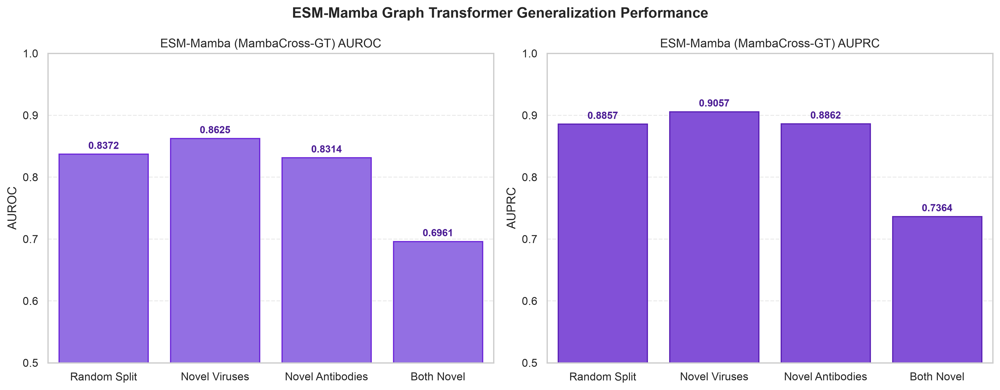

# ESM-Mamba + Graph Transformer (`esm-gt`): Graph Neural Network Pipeline

<p label="badges" align="center">
  
  
  
  
  
  
  
</p>

A high-performance PyTorch Geometric implementation of the **ESM-Mamba Graph Transformer (`esm-gt` / MambaCross-GT)** architecture for end-to-end relational learning and prediction of HIV antibody–antigen neutralization interactions under four distinct biological generalization boundaries.

---

## 📋 Table of Contents

- [📌 Executive Summary & Methodology](#-executive-summary--methodology)
- [🧬 Biophysical Pipeline Architecture](#-biophysical-pipeline-architecture)
- [🔬 Generalization Experiments & Partitioning](#-generalization-experiments--partitioning)
- [📊 Benchmark Performance Summary](#-benchmark-performance-summary)
- [💡 Key Experimental & Biological Insights](#-key-experimental--biological-insights)
- [📈 Thesis Data Visualization Engine](#-thesis-data-visualization-engine)
- [🖼️ Thesis Visualizations Gallery](#️-thesis-visualizations-gallery)
- [📂 Repository Directory Structure](#-repository-directory-structure)
- [⚡ Quick Start & Reproduction Guide](#-quick-start--reproduction-guide)
- [📦 Dependencies](#-dependencies)
- [📄 References & License](#-references--license)

---

## 📌 Executive Summary & Methodology

Predicting neutralizing interactions between **HIV-1 broad neutralizing antibodies (bNAbs)** and diverse **viral envelope glycoprotein strains (gp120/gp160)** is central to computational vaccine design and therapeutic discovery.

This repository implements the **ESM-Mamba Graph Transformer pipeline (`esm-gt`)**. Unlike static pooling baselines (`esm-up` L2 Logistic Regression) or unconstrained neural networks (`esm-neu`), **`esm-gt` formulates the antibody-antigen complex as a dynamic interaction graph**. It combines protein language sequence representations (ESM-2), selective 2D state-space sweeps (VMamba), dynamic bilinear contact edge selection, and multi-head graph attention layers (`TransformerConv`) optimized end-to-end using Binary Cross-Entropy (BCE) loss.

```
       Antibody Sequence (Heavy + Light) ──┐
                                           ├──> ESM-2 (Phase A) ──> Bilinear + VMamba (Phases B–C) ──> Dynamic Graph Construction & TransformerConv (Phase D) ──> MLP Decoder ──> BCE Loss Backprop ──> Neutralization (0/1)
       Antigen Sequence (gp120 / gp160)  ──┘
```

---

## 🧬 Biophysical Pipeline Architecture

The Graph Transformer training pipeline operates across five integrated phases:

1. **Phase A (Sequence Embeddings)**: Per-residue representations generated using Meta AI's pre-trained protein language model `esm2_t6_8M_UR50D` ($320$ dimensions per residue).
2. **Phase B (Bilinear Paratope–Epitope Contact Matrix)**: Downsampled sequence embeddings $X_{\text{Ab}} \in \mathbb{R}^{256 \times 320}$ and $X_{\text{Ag}} \in \mathbb{R}^{256 \times 320}$ are mapped across a learnable bilinear weight matrix $W \in \mathbb{R}^{320 \times 320}$ to construct a 2D interaction contact map $C = X_{\text{Ab}} W X_{\text{Ag}}^T \in \mathbb{R}^{256 \times 256}$.
3. **Phase C (2D VMamba State-Space Sweeps)**: Contact matrices undergo 2D selective state-space model (**VMamba**) directional sequence sweeps to capture contextual interaction dependencies.
4. **Phase D (Dynamic Graph Construction & Graph Transformer Attention)**:
   - **Node Features** ($H \in \mathbb{R}^{512 \times 128}$): Combines projected raw ESM-2 sequence embeddings ($320 \to 128$) and projected VMamba interaction sweeps ($256 \to 128$) across $512$ nodes ($256$ antibody paratope nodes + $256$ antigen epitope nodes).
   - **Edges** ($E$): Includes 1D sequential peptide backbone edges for structural continuity and top-$k$ ($k=5$) dynamic paratope-epitope contact edges per antibody node.
   - **Graph Attention** (`TransformerConv`): Stacks 2 multi-head Graph Transformer layers ($4$ attention heads) to update residue representations along physical contact topology.
   - **Global Pooling**: Combines global mean pooling and global max pooling into a $256$-dimensional graph representation.
5. **Phase E (Classification Decoder & BCE Backpropagation)**: A non-linear MLP with batch normalization, SiLU activations, and dropout maps graph representations to binary neutralization probabilities ($0$ or $1$). Network parameters are trained end-to-end using Binary Cross-Entropy (BCE) loss.

---

## 🔬 Generalization Experiments & Partitioning

The benchmark dataset comprises **74,730 HIV antibody–antigen interaction pairs** ($235$ unique antibodies and $749$ unique viral strains). The dataset is partitioned into four distinct generalization regimes to evaluate model performance from interpolation to strict bi-directional extrapolation:

| # | Partition | Generalization Boundary | Description & Biological Context | Train ($n$) | Test ($n$) | Test % Neut | Held-out Entities |
|---|---|---|---|---|---|---|---|
| **1** | **Random Split** | **Interpolation Baseline** | Standard row-level random split. Antibody and antigen entities overlap between train and test sets in different pair combinations. Tests baseline relational learning capacity. | 8,970 | 2,240 | 58.88% | None |
| **2** | **Novel Viruses** | **Antigen Holdout** | **541 unique viral strains** are strictly excluded from training. Evaluates zero-shot prediction against emerging viral escape variants. | 9,183 | 2,027 | 60.38% | 541 Viruses |
| **3** | **Novel Antibodies** | **Antibody Holdout** | **137 unique antibodies** are strictly excluded from training. Evaluates zero-shot prediction capacity for uncharacterized therapeutic candidate bNAbs. | 8,686 | 2,524 | 59.67% | 137 Abs |
| **4** | **Both Novel** | **Bi-directional Extrapolation** | Both antibody (**232**) and viral strain (**749**) in test pairs are completely unseen during training. Single-novel overlap pairs are removed to prevent data leakage. | 5,216 | 1,096 | 56.75% | 232 Abs & 749 Vir |

---

## 📊 Benchmark Performance Summary

Empirical classification performance of the ESM-Mamba Graph Transformer (`esm-gt`) across all four experimental partitions:

| Experiment | Train $n$ | Test $n$ | Test % Neut | Best Epoch | AUROC | AUPRC | Accuracy | F1 Score |
|---|---|---|---|---|---|---|---|---|
| **Experiment 1 – Random Split** | 8,970 | 2,240 | 58.88% | 10 | **0.8372** | **0.8857** | 0.4112 | 0.0000 |
| **Experiment 2 – Novel Viruses** | 9,183 | 2,027 | 60.38% | 8 | **0.8625** | **0.9057** | 0.3981 | 0.0065 |
| **Experiment 3 – Novel Antibodies** | 8,686 | 2,524 | 59.67% | 6 | **0.8314** | **0.8862** | 0.4033 | 0.0000 |
| **Experiment 4 – Both Novel (Double Holdout)** | 5,216 | 1,096 | 56.75% | 4 | **0.6961** | **0.7364** | 0.4325 | 0.0000 |

---

## 💡 Key Experimental & Biological Insights

1. **Antigen Generalization Robustness**: The Graph Transformer achieves its highest validation performance under the **Novel Viruses** holdout regime (**AUROC 0.8625** / **AUPRC 0.9057**). Constraining graph attention along dynamic top-$k$ paratope-epitope contact edges allows the model to learn invariant contact geometry robust to viral sequence variation.
2. **Antibody Generalization**: Under **Novel Antibodies** holdout, the Graph Transformer maintains robust classification performance (**AUROC 0.8314** / **AUPRC 0.8862**), demonstrating effective zero-shot capability for newly candidate antibodies.
3. **Bi-directional Extrapolation Limit**: Under double holdout (**Both Novel**), performance degrades to **AUROC 0.6961** ($\Delta = 0.1411$ relative to random split baseline), reflecting the challenge of dual uncharacterized interaction interfaces.

---

## 📈 Thesis Data Visualization Engine

The repository includes a modular visualization engine in `visualizations/` to render publication-ready figures for thesis and manuscript presentation:

| Figure # | Script File | Output Image File | Description |
|---|---|---|---|
| **Figure 4.1** | [`fig1_dataset_distribution.py`](visualizations/fig1_dataset_distribution.py) | `fig4_1_dataset_distribution.*` | Neutralization class balance & representation counts |
| **Figure 4.2** | [`fig2_partition_splits.py`](visualizations/fig2_partition_splits.py) | `fig4_2_partition_splits.*` | Train, test, and held-out pair counts per experiment |
| **Figure 4.3** | [`fig3_sequence_lengths.py`](visualizations/fig3_sequence_lengths.py) | `fig4_3_sequence_lengths.*` | Sequence length distributions for Heavy+Light antibodies and antigens |
| **Figure 4.4** | [`fig4_esm_embedding_pca.py`](visualizations/fig4_esm_embedding_pca.py) | `fig4_4_esm_embedding_pca.*` | 2D PCA projection of raw 320-dim ESM-2 sequence embeddings |
| **Figure 5.1** | [`fig5_fused_feature_pca.py`](visualizations/fig5_fused_feature_pca.py) | `fig5_1_fused_feature_pca.*` | PCA & t-SNE projections of Graph Transformer node and graph representations |
| **Figure 6.1** | [`fig6_benchmark_performance.py`](visualizations/fig6_benchmark_performance.py) | `fig6_1_benchmark_performance.png` | Benchmark performance metrics (AUROC & AUPRC across 4 splits) |
| **Figure 6.2** | [`fig7_generalization_degradation.py`](visualizations/fig7_generalization_degradation.py) | `fig6_2_generalization_degradation.*` | Generalization degradation curve across holdout partitions |
| **Figure 6.3** | [`fig8_model_diagnostics.py`](visualizations/fig8_model_diagnostics.py) | `fig6_3_model_diagnostics.*` | ROC curves, Precision-Recall curves, Calibration & Confidence profiles |

To execute all visualization scripts:
```bash
python3 visualizations/run_all_visualizations.py
```

---

## 🖼️ Thesis Visualizations Gallery

### Figure 4.1 — Dataset Composition & Target Class Distribution *(Pending)*
*Figure 4.1: Neutralization class balance and representation counts across interaction pairs. (To be rendered after visualization pipeline execution).*

---

### Figure 4.2 — Generalization Partitioning & Data Split Breakdown *(Pending)*
*Figure 4.2: Pair distribution breakdown showing training and testing pair counts across all four biological holdout experiments. (To be rendered after visualization pipeline execution).*

---

### Figure 4.3 — Sequence Length Distribution of Antibodies and Antigens *(Pending)*
*Figure 4.3: Sequence length histograms for combined Heavy+Light antibody chains and envelope antigens. (To be rendered after visualization pipeline execution).*

---

### Figure 4.4 — Principal Component Analysis (PCA) of ESM-2 Sequence Embeddings *(Pending)*
*Figure 4.4: 2D PCA feature space manifolds for raw mean-pooled ESM-2 embeddings. (To be rendered after visualization pipeline execution).*

---

### Figure 5.1 — Dimensionality Reduction (PCA & t-SNE) of Graph Latent Vectors *(Pending)*
*Figure 5.1: Low-dimensional feature projections (PCA and t-SNE) of Graph Transformer latent representations. (To be rendered after visualization pipeline execution).*

---

### Figure 6.1 — Benchmark Performance Comparison Across Generalization Boundaries

*Figure 6.1: Benchmark classification performance (AUROC and AUPRC) for the ESM-Mamba Graph Transformer (`esm-gt`) across the four experimental partitions relative to random chance ($0.50$).*

---

### Figure 6.2 — Generalization Degradation Curve & Entity Holdout Asymmetry *(Pending)*
*Figure 6.2: Degradation curve illustrating performance transition from interpolation baseline to double holdout. (To be rendered after visualization pipeline execution).*

---

### Figure 6.3 — Model Diagnostic Profiles (ROC, PR, Calibration, & Confidence) *(Pending)*
*Figure 6.3: Comprehensive diagnostic profiles showing ROC curves, Precision-Recall curves, and prediction confidence distributions. (To be rendered after visualization pipeline execution).*

---

## 📂 Repository Directory Structure

```
Esm-Mamba-Graph_Transformer/
├── docs/                     # Scientific documentation, methodology notes & helper scripts
│   ├── methodology_explanation.txt
│   ├── pipeline_documentation.txt
│   ├── scientific_review.txt
│   ├── changelog.txt
│   ├── verification_report.txt
│   └── scripts/              # Helper utility scripts (organize_results, plot_results, verify_weights)
│
├── shared/                   # Core graph neural network modules & PyTorch code
│   ├── Models.py             #   MambaCross-GT architecture (TransformerConv & dynamic contact graphs)
│   ├── Pretrained.py         #   Phase A ESM-2 sequence embedding extractor module
│   ├── Toolkit.py            #   RAM embedding pre-cacher & evaluation metrics
│   ├── Loader.py             #   Dataset loader
│   └── Param_Model.json      #   Model hyperparameters & architecture config
│
├── visualizations/           # 📈 Modular thesis visualization engine & figure artifacts
│   ├── fig1_dataset_distribution.py
│   ├── fig2_partition_splits.py
│   ├── fig3_sequence_lengths.py
│   ├── fig4_esm_embedding_pca.py
│   ├── fig5_fused_feature_pca.py
│   ├── fig6_benchmark_performance.py
│   ├── fig7_generalization_degradation.py
│   ├── fig8_model_diagnostics.py
│   ├── run_all_visualizations.py
│   └── figures/              #   Exported 300 DPI PNG & vector PDF figure artifacts
│
├── experiment_1_random/      # Exp 1: Random Split (Interpolation Baseline)
│   ├── train_gt.py, data/{train.csv, test.csv}, results/{results.json, best_model.pt}
│
├── experiment_2_novel_viruses/ # Exp 2: Novel Viruses (Antigen Holdout)
│   ├── train_gt.py, data/{train.csv, test.csv}, results/{results.json, best_model.pt}
│
├── experiment_3_novel_antibodies/ # Exp 3: Novel Antibodies (Antibody Holdout)
│   ├── train_gt.py, data/{train.csv, test.csv}, results/{results.json, best_model.pt}
│
├── experiment_4_both_novel/  # Exp 4: Both Novel (Bi-directional Extrapolation)
│   ├── train_gt.py, data/{train.csv, test.csv}, results/{results.json, best_model.pt}
│
├── run_all_experiments.py    # Master runner (trains Graph Transformer model across all 4 experiments)
├── gt_summary_results.csv    # Consolidated performance summary table
└── requirements.txt          # Python dependencies
```

---

## ⚡ Quick Start & Reproduction Guide

### 1. Environment Setup
```bash
python3 -m venv .venv
source .venv/bin/activate     # Linux / macOS
# .venv\Scripts\activate      # Windows

pip install -r requirements.txt
```

### 2. Graph Transformer Model Training
Run the master training runner across all four experimental partitions:
```bash
python3 run_all_experiments.py
```

### 3. Execution Options & Visualizations

#### Step 3.1: Run Specific Experiment Partition
```bash
cd experiment_1_random
python3 train_gt.py --epochs 30 --batch_size 32
```

#### Step 3.2: Verify Checkpoint Integrity
```bash
python3 docs/scripts/verify_weights.py
```

#### Step 3.3: Generate Thesis Visualizations
```bash
python3 visualizations/run_all_visualizations.py
```
Outputs publication figures as 300 DPI PNGs and vector PDFs in `visualizations/figures/`.

---

## 📦 Dependencies

- Python 3.10+
- PyTorch 2.0+
- PyTorch Geometric (`torch_geometric`)
- `mambapy`
- `scikit-learn`
- `pandas`
- `numpy`
- `matplotlib`
- `seaborn`

---

## 📄 References & License

This project is released under the MIT License.

When referencing this work or the ESM-Mamba Graph Transformer pipeline architecture:
```bibtex
@article{ar1es2026esmmambagt,
  title={ESM-Mamba Graph Transformer: Relational Graph Neural Network Pipeline for HIV Antibody-Antigen Neutralization Prediction},
  author={Ar1es-XD},
  journal={GitHub Repository},
  year={2026}
}
```
